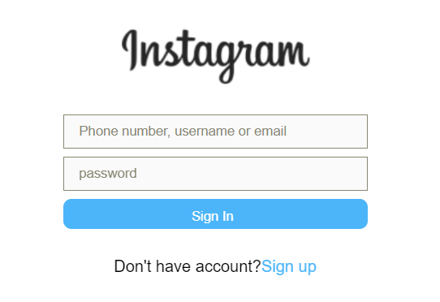
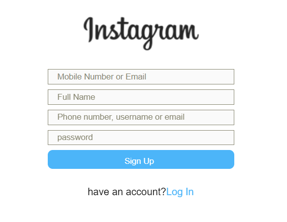

# Instagram Login Frontend

A user page similar to Instagram, built with React, featuring conditional rendering for sign-up and login options.

## Table of Contents
- [Description](#description)
- [Requirements](#requirements)
- [Getting Started](#getting-started)
- [Usage](#usage)
- [Styling](#styling)

## Description

In this project, we have created a user page that resembles Instagram's login page. Users can choose to either sign up or log in, and the user interface dynamically displays the appropriate input fields based on their choice. This project demonstrates the use of React and conditional rendering to provide a clean and intuitive user experience.

### Key Features
- Toggle between sign-up and login views.
- Responsive design with a clean layout.
- Input fields for username, password, name, and email (for sign-up).
- Instagram logo for branding.
- User-friendly switch between sign-up and login.

## Requirements

To run this project, you need to have the following installed:

- [Node.js](https://nodejs.org/)
- [React](https://reactjs.org/)

## Getting Started

1. Clone the repository:
   git clone 

   ## Change to the project directory:
cd 

## Install the project dependencies:
npm install

 ## Usage
Start the development server:
npm start
Open your web browser and visit http://localhost:3000 to view the project.

Use the "Sign Up" and "Log In" buttons to toggle between sign-up and login views. Input fields will update accordingly.

## Styling
The project's styling is achieved using CSS. The Instagram logo is displayed prominently, and input fields are designed for user-friendly interaction.
